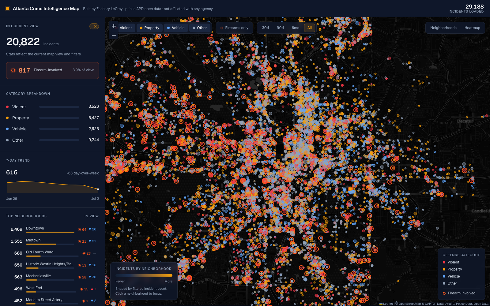
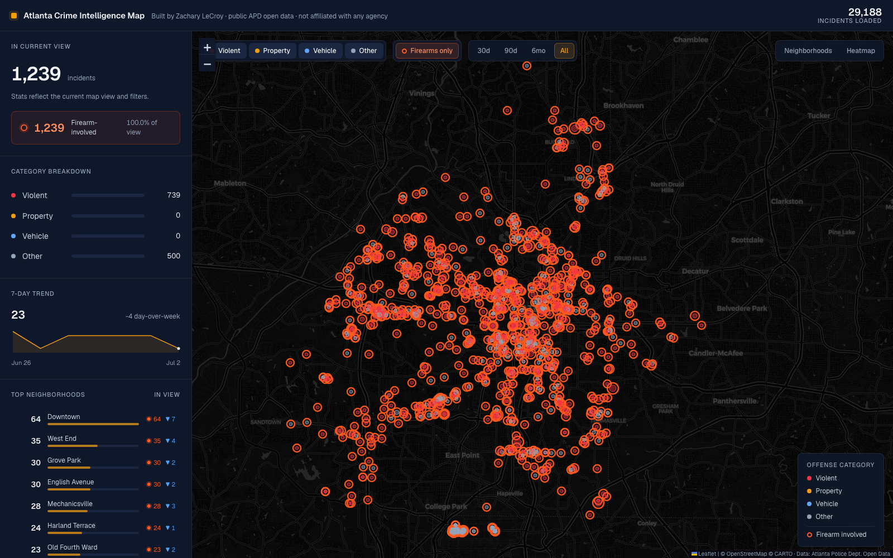
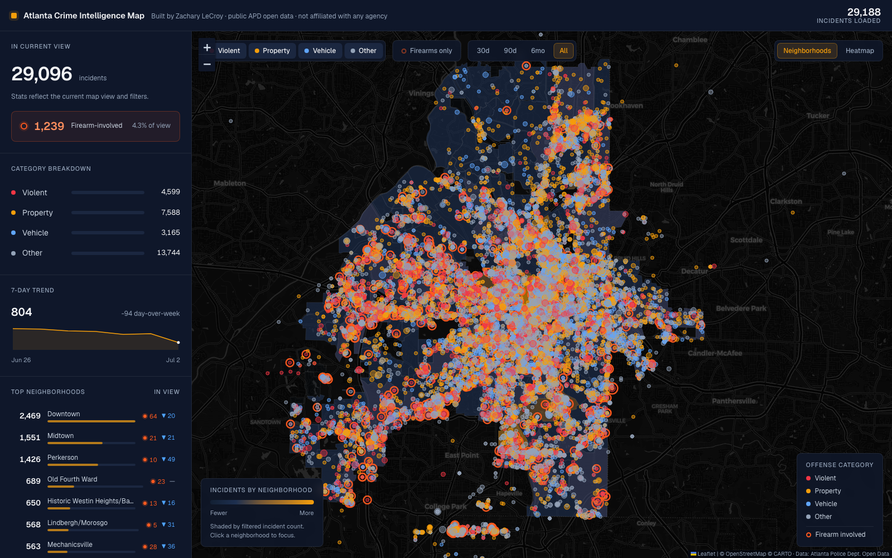
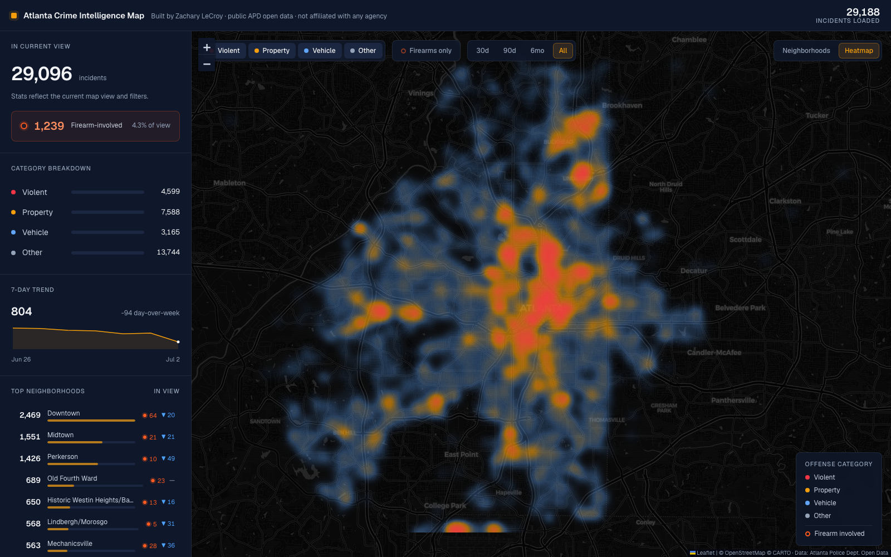

# Atlanta Crime Intelligence Map

A full-screen, dark-themed situational-awareness map for City of Atlanta crime
incidents — built in the spirit of [liveuamap.com](https://liveuamap.com), but
for metro-Atlanta public-safety data. Incidents are plotted as color-coded
bubbles over a dark basemap, with a live intelligence panel that recomputes
totals, a firearm-involvement KPI, category breakdowns, a 7-day trend, top
neighborhoods, and a day-of-week × hour temporal grid for whatever is in view.

Live: **[atl-crime-map.vercel.app](https://atl-crime-map.vercel.app)**

Built by **Zachary LeCroy** to demonstrate crime-analysis and GIS skills.
Not affiliated with the City of Atlanta, the Atlanta Police Department, or any
agency.



| Firearm-only view | Neighborhood choropleth | Hotspot heatmap |
| --- | --- | --- |
|  |  |  |

## Data

- **Source:** [Atlanta Police Department Open Data](https://opendata.atlantapd.org/) —
  live NIBRS Crime Incidents FeatureServer
  (`services3.arcgis.com/Et5Qfajgiyosiw4d/.../OpenDataWebsite_Crime_view`).
- **Neighborhood boundaries:** APD Open Data `neighborhood` FeatureServer
  (242 City-of-Atlanta neighborhood polygons), generalized to a 118 KB GeoJSON.
- **Records:** 29,188 incidents (points with valid coordinates), 1,239
  firearm-involved.
- **Date range:** 2026-01-04 → 2026-07-02 (trailing ~180 days).
- **Retrieved:** 2026-07-03. The site shows a "Data updated" stamp read from the
  JSON, and a GitHub Action refreshes the data daily (see below).
- Real, incident-level data only — nothing is fabricated. Locations are snapped
  to the nearest street/block by APD for anonymity, and house numbers are
  redacted at the source.

To re-pull fresh data, see [`data/REFRESH.md`](data/REFRESH.md). The whole
pipeline is one stdlib-only script:

```bash
python3 data/fetch_incidents.py
```

## Features

- **Dark full-screen map** (Leaflet + CartoDB `dark_all` tiles) centered on
  Atlanta, canvas-rendered so ~30k points stay smooth.
- **Color-coded incident bubbles** by offense category — violent, property,
  vehicle, other — subtly sized by recency (newer = larger). Categories are
  always paired with a labeled legend, never color alone.
- **Firearm prominence.** Firearm-involved incidents wear a bright red-orange
  ring that reads against any category color, at any zoom. A headline KPI shows
  the firearm count and % of the current view; a **Firearms only** filter
  isolates them; the neighborhood table and incident popups carry firearm
  counts/badges.
- **Intelligence panel** that recomputes as you pan/zoom/filter:
  - total incidents in view + firearm KPI,
  - category breakdown with proportional bars,
  - 7-day trend sparkline with day-over-week delta,
  - **top-10 neighborhoods** in view, each with its firearm count and a
    last-30d-vs-prior-30d trend arrow (click to focus the map on it),
  - a **day-of-week × hour** temporal grid (7×24, Atlanta local time) shaded by
    density — the classic crime-analysis "when" chart — which respects the
    firearm filter so you can see when gun incidents cluster,
  - a recent-incident feed (offense, neighborhood, date; firearm flagged).
- **Neighborhood analytics.** A **Neighborhoods** choropleth shades the 242
  Atlanta neighborhoods by filtered incident count (sequential dark→amber ramp),
  and clicking a neighborhood — on the map or in the top-10 list — filters the
  whole app to it (click again to clear).
- **Filters:** category toggles, firearms-only, date-range chips
  (30d / 90d / 6mo / All), a **heatmap** hotspot toggle, and the neighborhood
  choropleth toggle.
- **Incident popups** with offense, date, neighborhood, APD zone, place type,
  and a firearm-involved badge.
- **Shareable views:** `?lat=&lon=&z=&heat=1&choro=1&firearm=1` deep-links to a
  specific location/zoom and pre-set layers/filters.

## Firearm involvement — method

The `firearm` flag comes **directly from APD's `FireArmInvolved` field**, not
from inference. It is well-populated and internally consistent, so no string
derivation is applied:

- 4.2% of all incidents (1,239 / 29,188) are firearm-involved.
- The flag tracks offense type as expected: Weapon-Law Violations 96%, Homicide
  83%, Aggravated Assault 46%, Robbery 38%, and ~0% for property/fraud offenses.

Deriving involvement from offense strings (e.g. treating every "Weapon Law
Violation" as a gun) was considered and **rejected** — it would misclassify
non-firearm weapon offenses and inflate the count. The native field is the
accurate source.

## Categories

APD `NIBRS_Bucket` values are mapped into four analyst categories:

| Category | Color     | Includes (examples)                                          |
| -------- | --------- | ------------------------------------------------------------ |
| Violent  | `#F23645` | Homicide, Aggravated Assault, Robbery, Rape, Sex Offenses    |
| Property | `#F59E0B` | Burglary, Larceny, Shoplifting, Fraud, Damage to Property    |
| Vehicle  | `#60A5FA` | Auto Theft, Theft From Auto                                  |
| Other    | `#94A3B8` | Drug/Narcotic, Weapon-Law, Animal Cruelty, All Other Offenses|

Firearm involvement is orthogonal to category and rendered as a separate
red-orange ring (`#FF5A1F`), reserved exclusively for that purpose.

## Neighborhood join

Incidents carry an APD `NhoodName`; the boundary layer uses the same field, so
the join is mostly exact. Match rate: **~91% of all incidents** join to a
polygon (about **97%** of incidents that have a known neighborhood — 8% of
records have no APD neighborhood and are excluded from neighborhood analytics).
A small alias table (see `js/config.js`) patches the largest label mismatches
(e.g. "Historic Westin Heights/Bankhead" → "Bankhead"). Well above the 80%
threshold, so the choropleth is enabled.

## Automation

- `.github/workflows/refresh.yml` re-pulls the data daily (10:00 UTC) and
  commits `data/incidents.json` when it changes.
- The Vercel project is connected to this GitHub repo, so that push (and any
  other push to `main`) auto-deploys to production. See
  [`SETUP.md`](SETUP.md) for details and the token-based fallback.

## Time zone note

APD returns occurrence times as true-UTC epochs. The preprocessor converts each
to **America/New_York** before deriving the date, day-of-week, and hour — so the
temporal grid reflects Atlanta wall-clock time. This was validated against APD's
own `Day_of_the_week` field (Eastern-derived day matches 100% of sampled
records; a naive UTC read matches only 79.5%).

## Run locally

Static site — no build step. Serve the directory over HTTP so the browser can
fetch the JSON/GeoJSON:

```bash
python3 -m http.server 8899 --directory .
# then open http://localhost:8899
```

## Tech notes

- **Vanilla JS (ES modules), no frameworks.** `Leaflet` for the map,
  `Leaflet.heat` for the hotspot layer — both from CDN.
- Rendering: separate Leaflet canvas renderers on dedicated panes (choropleth
  under bubbles, firearm halos under the colored bubble). Filtering toggles
  marker membership in place rather than rebuilding, and the in-view panel
  recompute is coalesced to one pass per animation frame.
- Design system (LeCroy brand): navy near-black surfaces, a slate text ramp,
  amber (`#F59E0B`) as the single interactive accent, red-orange reserved for
  firearms, 1px hairline borders, Geist type, tabular-nums on all figures, a 4px
  spacing grid, and 6–12px radii.

## Project layout

```
atl-crime-map/
├── index.html
├── css/styles.css
├── js/
│   ├── app.js          # orchestrator: data -> map -> panel -> controls
│   ├── config.js       # categories, colors, firearm/choropleth config, aliases
│   ├── data.js         # fetch incidents + neighborhoods, name normalization
│   ├── mapview.js      # Leaflet map, bubbles, firearm halos, heat, choropleth
│   ├── panel.js        # in-view stats, firearm KPI, top hoods, time grid, feed
│   └── controls.js     # category / firearm / date / heat / choropleth controls
├── data/
│   ├── incidents.json       # preprocessed incidents (generated, daily)
│   ├── neighborhoods.geojson # 242 Atlanta neighborhood polygons
│   ├── fetch_incidents.py
│   └── REFRESH.md
├── .github/workflows/refresh.yml  # daily data refresh
├── SETUP.md
└── docs/               # screenshots
```
